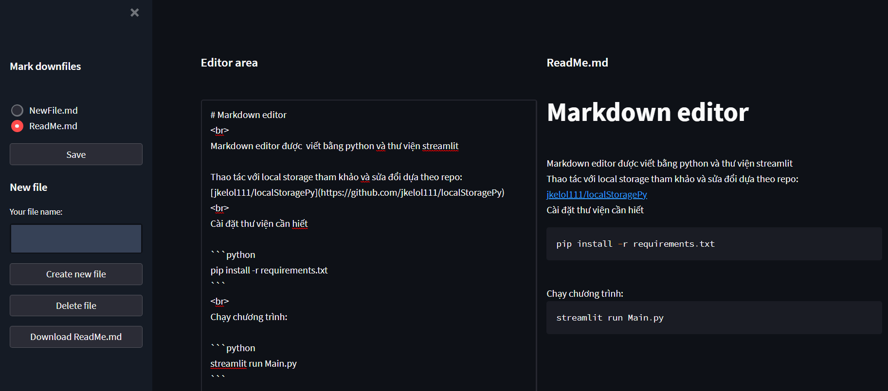

# Markdown editor
<br>
Markdown editor được  viết bằng python và thư viện streamlit

Thao tác với local storage tham khảo và sửa đổi dựa theo repo: [jkelol111/localStoragePy](https://github.com/jkelol111/localStoragePy)
<br>
Cài đặt thư viện cần hiết

```python
pip install -r requirements.txt
```
<br> 
Chạy chương trình:

```python
streamlit run Main.py
```

